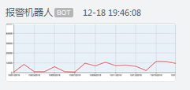

# WXRobot
Unity接入企业微信机器人发送消息

## 使用场景
Unity自动打包出错等信息可以自动通知到群机器人

## 示例
### 1.发送文本消息
```csharp
var WebHookUrl = "填入你的机器人地址";
WxRobotHelper.PostText(WebHookUrl, "Hello Robot!", "@all");
```


### 2.发送Markdown消息
```csharp
var sb = new StringBuilder();
sb.AppendLine("<font color=\"red\">颜色文本</font>");
sb.AppendLine("<font color=\"green\">颜色文本</font>");
sb.AppendLine("<font color=\"blue\">颜色文本</font>");
sb.AppendLine("<font color=\"info\">企业微信内置颜色</font>");
sb.AppendLine("<font color=\"comment\">企业微信内置颜色</font>");
sb.AppendLine("<font color=\"warning\">企业微信内置颜色</font>");
WxRobotHelper.PostMarkdown(WebHookUrl, sb.ToString());
```


### 3.发送图片信息
```csharp
var texture = Resources.Load<Texture2D>("test.png");
WxRobotHelper.PostImage(WebHookUrl, texture);
```


# 参考
[企业微信开发者中心](https://developer.work.weixin.qq.com/document/path/91770)
